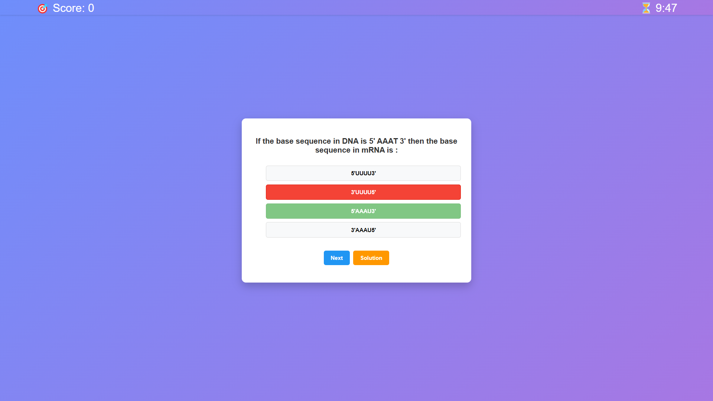
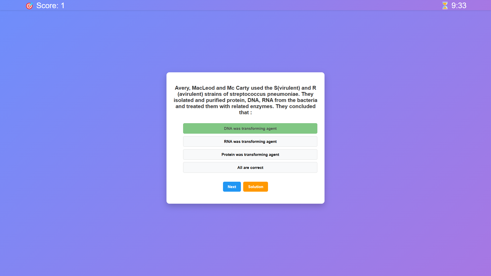
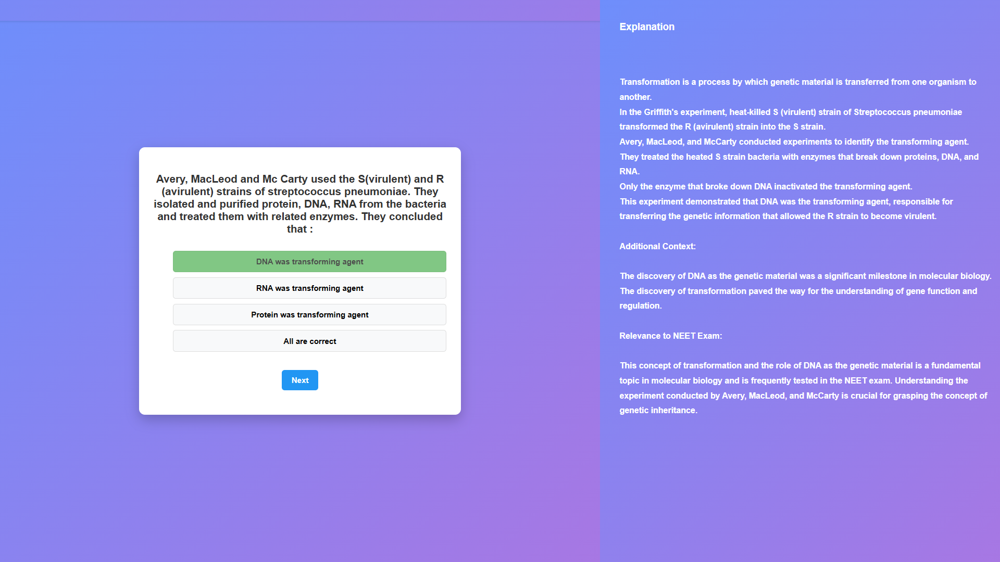
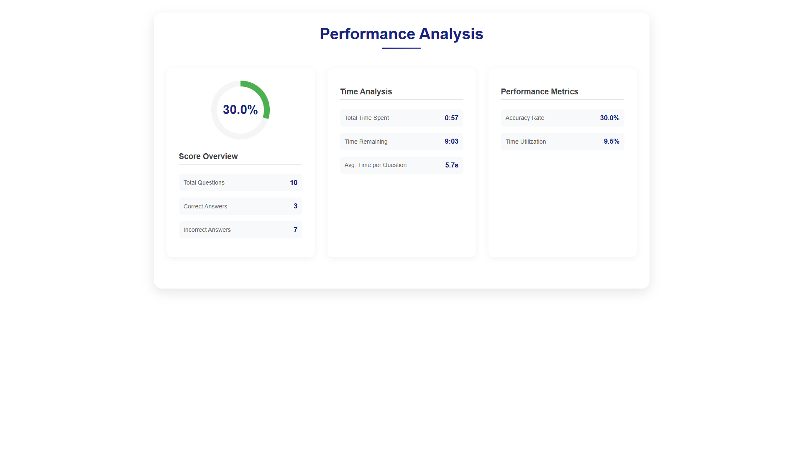

# Quiz App

This is a React-based quiz application that fetches questions from an external API and provides users with an interactive platform to test their knowledge. The app not only evaluates user responses but also offers detailed analytics on performance, including time taken, accuracy, and more.

## Features

- **Dynamic Question Fetching**: Questions, along with their options and solutions, are fetched from an external API: [https://api.jsonserve.com/Uw5CrX](https://api.jsonserve.com/Uw5CrX).
- **Interactive Quiz Flow**: As users progress through the quiz, their scores increase with each correct answer, culminating in a final score display at the end.
- **Performance Analysis**: The `ReportPage` component provides a comprehensive analysis of the user's performance, including metrics such as time taken, correct and incorrect answers, and overall accuracy.
- **Solution Sidebar**: A sidebar reveals the solution for each question, which becomes accessible only after the question has been attempted.

## Installation

1. **Clone the Repository**:

   npm git clone https://github.com/suraj-shrivastav/quiz.git
   cd quiz
   npm install
   npm run dev

## Images

## Video

## AI Tools: The Saviour  

AI tools like ChatGPT and Claude.ai have been incredibly helpful during this project, especially in the CSS development.  
The **ReportPage** was heavily built with the assistance of these tools.  
